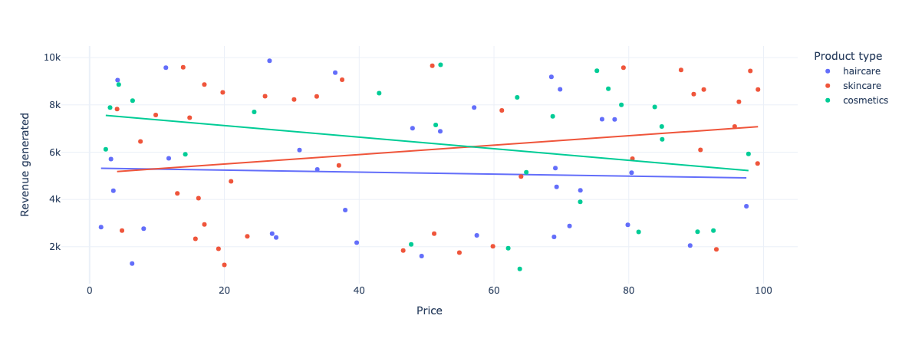
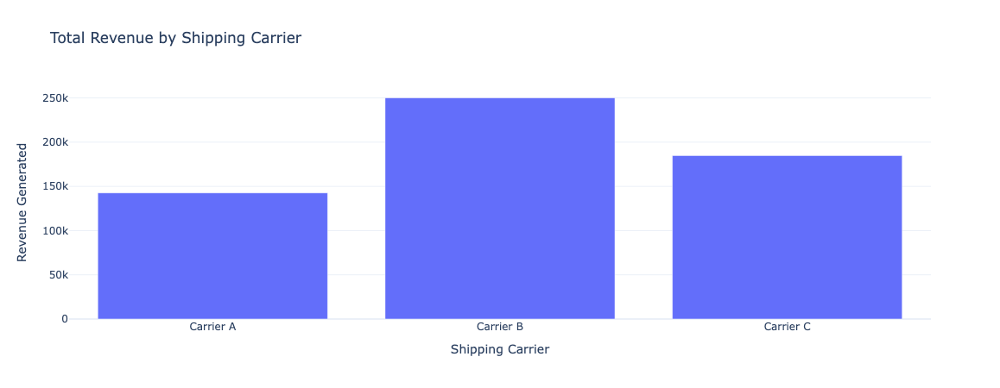

# Supply Chain Analytics

## Overview
Interactive analysis of supply chain performance metrics including revenue, stock levels, defect rates, and transportation costs.

## Features
- Revenue vs. Price correlation analysis
- Product-type sales distribution
- Carrier performance comparisons
- Defect rate analysis by transportation mode

## Results
1. 
2. 

## 🤝 Let's Connect

- [LinkedIn](https://www.linkedin.com/in/dpjani)
- [Personal Website](https://dpjani.github.io)
